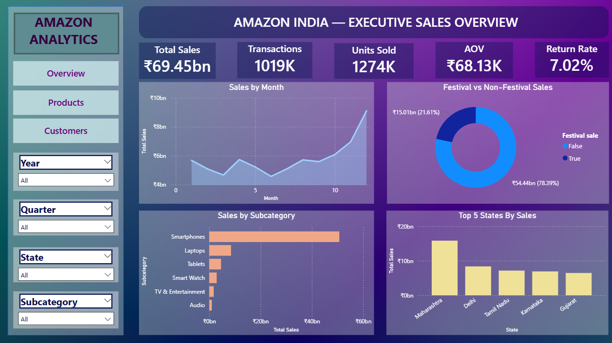
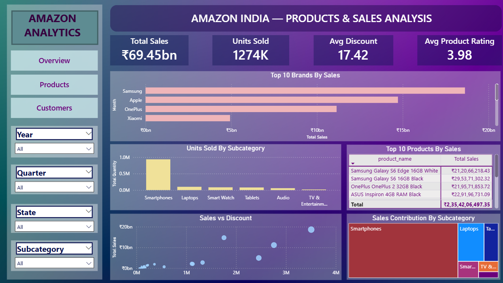

# 📊 Amazon India Sales Analytics Dashboard

A Power BI dashboard designed to analyze Amazon India sales performance, product trends, customer behavior, and demand patterns. This project transforms transaction-level sales data into interactive business insights using Power BI, DAX, and data visualization.

---

## 📌 Project Overview

**Amazon India Sales Analytics Dashboard** is an interactive Business Intelligence project developed using Microsoft Power BI.

The dashboard provides a comprehensive view of sales performance across products, brands, customers, subcategories, states, discounts, ratings, and order statuses.

It is organized into three analytical pages:

- **Executive Sales Overview** — Overall business performance
- **Product & Sales Analysis** — Product and brand performance
- **Customer & Demand Insights** — Customer behavior and demand patterns

---

## 🎯 Project Objective

The main objective of this project is to analyze Amazon India transaction data and convert it into meaningful business insights.

The dashboard focuses on:

- Understanding overall sales performance
- Identifying top-performing products and brands
- Analyzing sales across product subcategories
- Understanding customer spending behavior
- Comparing Prime and non-Prime sales
- Identifying sales and demand trends over time
- Analyzing discounts and their relationship with sales
- Understanding customer and product ratings
- Analyzing delivered, returned, and cancelled orders

---

## 🛠️ Technologies Used

- **Power BI** — Dashboard development and interactive visualization
- **DAX** — KPI calculations and analytical measures
- **Power Query** — Data cleaning and transformation
- **Excel / CSV** — Source transaction data
- **GitHub** — Project documentation and version control

---

## 📈 Dashboard Features

### 🏠 Executive Sales Overview

Provides a high-level view of Amazon India sales performance.

**Key KPIs:**
- Total Sales
- Total Transactions
- Total Quantity
- Average Order Value
- Return Rate

**Key Analysis:**
- Monthly Sales Trend
- Festival vs Non-Festival Sales
- Sales by Subcategory
- Top 5 States by Sales

---

### 📦 Product & Sales Analysis

Analyzes product and brand performance along with discounts and ratings.

**Key KPIs:**
- Total Sales
- Units Sold
- Average Discount
- Average Product Rating

**Key Analysis:**
- Top 10 Brands by Sales
- Sales Contribution by Subcategory
- Sales vs Discount
- Units Sold by Subcategory
- Top Products by Sales and Performance

---

### 👥 Customer & Demand Insights

Focuses on customer behavior, demand patterns, Prime membership, and order status.

**Key KPIs:**
- Total Customers
- Average Customer Rating
- Average Delivery Days
- Return Rate

**Key Analysis:**
- Demand Trend
- Sales by Customer Spending Tier
- Prime vs Non-Prime Sales
- Order Status by Subcategory

---

## 🖼️ Dashboard Preview

### Executive Sales Overview



### Product & Sales Analysis



### Customer & Demand Insights


---

## 💡 Key Insights

- **Festival sales account for approximately 78.39% of total sales**, indicating a strong contribution from festival-period purchasing.
- **Smartphones are the leading subcategory by sales**, making them a major contributor to overall revenue.
- **Samsung leads the displayed top brands by sales**, followed by other major smartphone and electronics brands.
- **Maharashtra leads the displayed top states by sales**, followed by Delhi, Tamil Nadu, Karnataka, and Gujarat.
- **Prime members contribute approximately 61.91% of total sales**, highlighting the significant contribution of Prime customers.
- The dashboard provides a clear view of **customer spending tiers, order outcomes, and demand patterns**.
- The **Sales vs Discount** analysis helps explore the relationship between discount levels and sales performance.

---

## 🎛️ Interactive Dashboard

The dashboard allows users to dynamically explore the data using interactive filters such as:

- Year
- Quarter
- State
- Subcategory
- Customer Spending Tier
- Prime Membership

Users can combine multiple filters to analyze specific business segments and compare their performance.

---

## 📐 DAX & Data Analysis

DAX was used to create dynamic measures for important business metrics such as:

- Total Sales
- Total Transactions
- Total Quantity
- Average Order Value
- Average Discount
- Average Delivery Days
- Customer and Product Ratings
- Return Rate
- Prime Sales
- Total Customers

The measures dynamically respond to the filters applied within the dashboard.

---

## 🗂️ Project Structure

```text
Amazon_india_sales_analytics_dashboard/
│
├── dashboard/
│   ├── Overview.png
│   ├── Products.png
│   └── Customers.png
│
└── README.md
